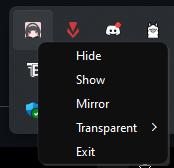

<div align="center">

</div>

# <div align="center">Astra Yao Crosshair</div>

This is a scope that will make you unrivaled! Personally, I have already become a radiant in Valorant with it. („¬ᴗ¬„)

Even though the project is a joke, I did everything to make this scope **easy to use**:

* You can _hide_ or _show_ the sight by pressing the " **`** " button on the English layout, or " **ё** " on the Russian layout;

* You can _flip_ the sight images horizontally by pressing the "**l alt**" button;

* The functions described above are also _available from the tray menu_, which is opened by right-clicking on the application icon in the tray;

<div align="center">
  
</div>

* Also, _in the tray menu_, there is an option to **change the image opacity value** (100%, 75%, 50%, 25%);

* Finally, you can **close the application** by clicking "_Exit_" in the application menu from the tray.

Interesting fact - you can put any of **your own images**. The main thing is that it is in _png format_ and _pre-fitted to the size of your screen_. 
To use your own image, name it "**astra_yao.png**" and replace it in the directory where the executable file "**Astra Yao Crosshair.exe**" is located.


## 🚀 Installing

**You can download the archive with the latest version of the program on the [releases page](https://github.com/Hitoshi144/Astra_Yao_Crosshair/releases)**

Follow these steps to set up and run the project locally:

### 1. Clone the repository
```bash
git clone https://github.com/Hitoshi144/Astra_Yao_Crosshair.git
cd Astra_Yao_Crosshair
```

### 2. Create a virtual environment
```bash
python -m venv venv
```

### 3. Activate the virtual environment
On Windows:
```bash
venv\Scripts\activate
```
On Linux/MacOS:
```bash
source venv/bin/activate
```

### 4. Install dependencies
```
pip install -r requirements.txt
```

### 5. Run the project
```
python main.py
```

## 🎉 That's it!
You can also improve the program by adding additional features.

If you liked this app at all, please give it a **star** rating (´ ω `♡). I would be very grateful.
